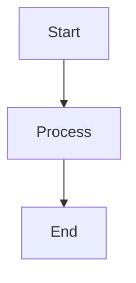

# Diagrams

This directory contains architecture and flow diagrams in Mermaid format.

## How to View Mermaid Diagrams

Mermaid diagrams can be viewed in:
1. **GitHub** - Renders automatically in .md files
2. **VS Code** - With Mermaid extension
3. **Online** - [mermaid.live](https://mermaid.live) - copy/paste content

## Diagrams Included

### ARCHITECTURE.mermaid
System architecture diagram showing:
- Major components (API, Orchestrator, Agents, RAG, Database)
- Component relationships
- Data flow between components

**Related Guide:** [docs/guides/EXECUTION_FLOW.md](../guides/EXECUTION_FLOW.md)

### sequence.mermaid
Sequence diagram showing:
- Step-by-step execution flow
- Interaction between components
- Request/response cycles

**Related Guide:** [docs/guides/EXECUTION_FLOW.md](../guides/EXECUTION_FLOW.md)

## Viewing in This Project

```bash
# View with Mermaid CLI
npm install -g @mermaid-js/mermaid-cli
mmdc -i ARCHITECTURE.mermaid -o ARCHITECTURE.svg

# Or use online viewer
# Copy content to https://mermaid.live
```

## Adding New Diagrams

If you need to add architecture diagrams:
1. Create a new .mermaid file
2. Use Mermaid syntax
3. Document it in this README
4. Link it from docs/guides/EXECUTION_FLOW.md

## Mermaid Syntax Examples



**Resources:**
- [Mermaid Documentation](https://mermaid.live/edit)
- [Syntax Guide](https://mermaid-js.github.io/mermaid/)
- [Editor](https://mermaid.live)

---

**Last Updated:** 2026-07-13
